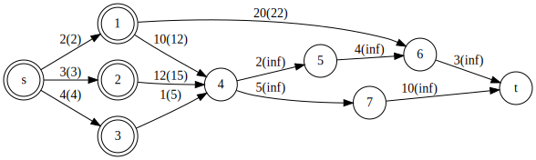
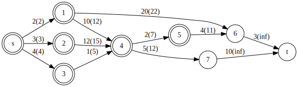
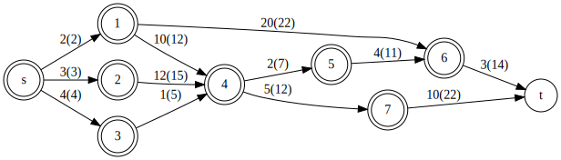

<!-- $theme: gaia -->
<!-- $size: 16:9 -->
<!-- page_number: true -->
<!-- paginate: true -->
# Marpサンプル

--- 

## 概要

Marpというツールを試す
- Markdown形式でスライドを作れる
- VSCodeに拡張があるので、同じく拡張機能が提供されているGraphvizと組み合わせて遊ぶ


---


---


━━━━━━━━━━━━━━━━━━━━━━━━━━━━━━━━━━━━
　　(2, 1)　(3, 2)　(4, 3)
━━━━━━━━━━━━━━━━━━━━━━━━━━━━━━━━━━━━
＜ーーーー 　　　prority_queue(cost, to) 　　　ーーーーー

---

━━━━━━━━━━━━━━━━━━━━━━━━━━━━━━━━━━━━
　　(3, 2)　(4, 3)　(12, 4)　(22, 6)
━━━━━━━━━━━━━━━━━━━━━━━━━━━━━━━━━━━━
＜ーーーー 　　　prority_queue(cost, to) 　　　ーーーーー

---

━━━━━━━━━━━━━━━━━━━━━━━━━━━━━━━━━━━━
　　(4, 3)　(12, 4)　(15, 4)　(22, 6)
━━━━━━━━━━━━━━━━━━━━━━━━━━━━━━━━━━━━
＜ーーーー 　　　prority_queue(cost, to) 　　　ーーーーー

---

━━━━━━━━━━━━━━━━━━━━━━━━━━━━━━━━━━━━
　　(5, 4)　(12, 4)　(15, 4)　(22, 6)
━━━━━━━━━━━━━━━━━━━━━━━━━━━━━━━━━━━━
＜ーーーー 　　　prority_queue(cost, to) 　　　ーーーーー

---

━━━━━━━━━━━━━━━━━━━━━━━━━━━━━━━━━━━━
　　(7, 5)　(12, 4)　(12, 7)　(15, 4)　(22, 6)
━━━━━━━━━━━━━━━━━━━━━━━━━━━━━━━━━━━━
＜ーーーー 　　　prority_queue(cost, to) 　　　ーーーーー

---

━━━━━━━━━━━━━━━━━━━━━━━━━━━━━━━━━━━━
　　(11, 6)　(12, 4)　(12, 7)　(15, 4)　(22, 6)
━━━━━━━━━━━━━━━━━━━━━━━━━━━━━━━━━━━━
＜ーーーー 　　　prority_queue(cost, to) 　　　ーーーーー

---

━━━━━━━━━━━━━━━━━━━━━━━━━━━━━━━━━━━━
　　(12, 4)　(12, 7)　(14, t)　(15, 4)　(22, 6)
━━━━━━━━━━━━━━━━━━━━━━━━━━━━━━━━━━━━
＜ーーーー 　　　prority_queue(cost, to) 　　　ーーーーー

---

━━━━━━━━━━━━━━━━━━━━━━━━━━━━━━━━━━━━
　　(14, t)　(15, 4)　(22, 6)　(22, t)
━━━━━━━━━━━━━━━━━━━━━━━━━━━━━━━━━━━━
＜ーーーー 　　　prority_queue(cost, to) 　　　ーーーーー

---

━━━━━━━━━━━━━━━━━━━━━━━━━━━━━━━━━━━━
　　(15, 4)　(22, 6)　(22, t)
━━━━━━━━━━━━━━━━━━━━━━━━━━━━━━━━━━━━
＜ーーーー 　　　prority_queue(cost, to) 　　　ーーーーー

---


## 所感

VSCode上で完結する(一番の利点) 
もちろん微調整が必要な場合はGUIのほうが良いと思う
形式言語で書けると少しずつ差分がある複数の図を書くのに便利
Kroki.ioというツールもあったがこれは毎変更ごとに生成されるURLが変わるので少し違う気がした
Draw.ioをVSCode上でやるのは結局PowerPointをいじっているのと同じな気がする 
ただしDraw.ioのほうが手に馴染んでいる場合は別

--- 

## 所感
今回使っていないもの
- 数式
$$
\sum_{x=1}^{n} \sum_{y=1}^{x} f(x, y)
$$
- コード
```
int hoge = 100;
```
- css, フォントなど

--- 
## 所感
今はVSCode上で色々で切るようになってきているので、どちらかというと様々な素材を統合して身内向けの共有、勉強会スライド等を手軽に作るのがよさそう

Marpに慣れるまでは手軽さよりもどかしさの方が大きい気がするが、MarkdownやCSSに慣れている場合は学習コストが低くできそう

上手く使えれば外部のデザインソフトなどでfixされた画像 + 形式言語によるシステム構成図, シーケンス図みたいな資料が作れるかも